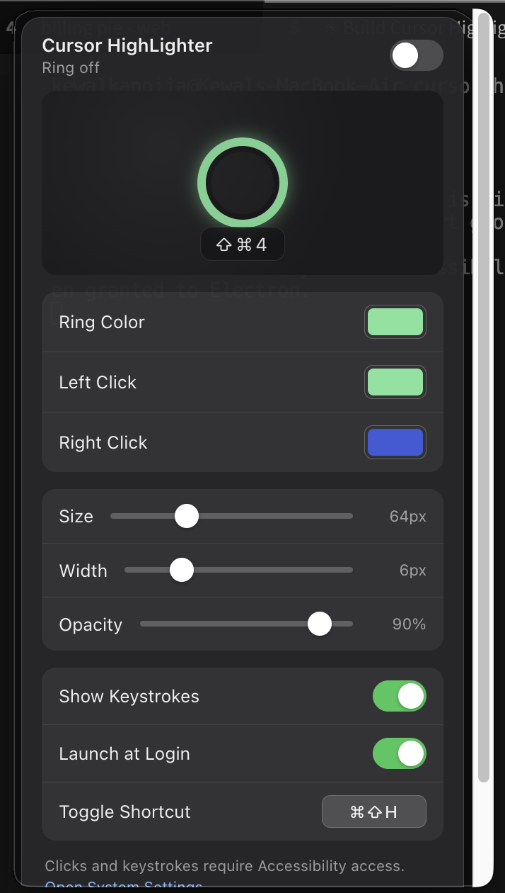

<div align="center">

# Cursor HighLighter

**Draw a colored ring around your cursor and put your keystrokes on screen.**
Perfect for screen recordings, live demos, tutorials, and code walkthroughs.

Menu-bar only — no Dock icon, no window clutter. macOS & Windows.

<a href="./docs/screenshots/settings.png">
  
</a>

</div>

---

## Table of contents

- [Features](#features)
- [Install](#install)
  - [macOS — Homebrew](#macos--homebrew-recommended)
  - [macOS — direct download](#macos--direct-download)
  - [Windows — direct download](#windows--direct-download)
- [Permissions (macOS)](#permissions-macos)
- [Usage](#usage)
- [Global toggle shortcut](#global-toggle-shortcut)
- [Development](#development)
- [Building distributables](#building-distributables)
- [Publishing a release](#publishing-a-release)
- [Publishing to a Homebrew tap](#publishing-to-a-homebrew-tap)
- [Tech stack](#tech-stack)
- [Project layout](#project-layout)
- [Troubleshooting](#troubleshooting)
- [Credits](#credits)
- [License](#license)

## Features

- 🎯 **Colored ring** follows the cursor on every display, at ~120 Hz.
- 🔴 **Flash-on-click** — separate colors for left- and right-click.
- ⌨️ **Keystroke overlay** — modifier-aware combos (e.g. `⇧⌘4`) fade in at the
  bottom of the active screen.
- 🎨 **Live customization** — color pickers, size / width / opacity sliders,
  toggles for keystrokes and launch-at-login.
- ⌨️ **Global toggle shortcut** — `⌘⇧H` by default, fully rebindable from
  inside the app.
- 🧭 **Multi-monitor aware** — one overlay per display, ring hands off cleanly
  when the cursor moves between screens.
- 🚀 **Launch at login** — one toggle, no scripts.
- 🕳️ **Draws through the notch / menu bar** so the ring never clips at the top.
- 💾 **Persistent** — every setting survives restarts. `Reset to Defaults`
  restores the shipped defaults in one click.
- 🖥️ **Cross-platform** — macOS (Intel + Apple Silicon) and Windows
  (x64 + arm64).

## Install

### macOS — Homebrew (recommended)

```bash
brew tap kewal28/cursor-highlighter
brew trust kewal28/cursor-highlighter        # one-time consent for third-party taps
brew install --cask cursor-highlighter
```

- The first line adds the tap (`kewal28/homebrew-cursor-highlighter`).
- The second tells Homebrew you consent to installing from a third-party tap
  — required since Homebrew 4.6 for any tap outside the official
  Homebrew organization.
- Both are one-time steps. `brew upgrade cursor-highlighter` picks up future
  releases automatically.

<details>
<summary>Prefer a one-liner?</summary>

```bash
brew tap kewal28/cursor-highlighter && \
  brew trust kewal28/cursor-highlighter && \
  brew install --cask cursor-highlighter
```

</details>

The tap lives at [`kewal28/homebrew-cursor-highlighter`](https://github.com/kewal28/homebrew-cursor-highlighter)
and pulls the latest DMG directly from GitHub Releases. See
[Publishing to a Homebrew tap](#publishing-to-a-homebrew-tap) if you're
setting up the tap for the first time.

### macOS — direct download

Grab the DMG for your chip from the
[Releases page](https://github.com/kewal28/cursor-highlighter/releases):

| Chip | File |
|-----|-----|
| Apple Silicon | `cursor-highlighter-<version>-mac-arm64.dmg` |
| Intel | `cursor-highlighter-<version>-mac-x64.dmg` |

Open the DMG and drag *Cursor HighLighter* into `/Applications`.

> **First-launch Gatekeeper bypass.** Because the build isn't signed with an
> Apple Developer certificate yet, macOS shows one of two messages the first
> time you launch it:
>
> - *"Cursor HighLighter cannot be opened because the developer cannot be
>   verified"* → right-click the app → **Open** → **Open**.
> - *"Cursor HighLighter.app is damaged and can't be opened"* → macOS's
>   quarantine flag is more aggressive. Strip it manually:
>
>   ```bash
>   xattr -cr "/Applications/Cursor HighLighter.app"
>   open -a "Cursor HighLighter"
>   ```
>
> Homebrew installs run the second command automatically via a `postflight`
> step in the cask — you'll only hit these prompts if you installed the DMG
> directly.

### Windows — direct download

Grab an installer from the
[Releases page](https://github.com/kewal28/cursor-highlighter/releases):

| Kind | File |
|-----|-----|
| Installer | `cursor-highlighter-<version>-win-x64.exe` |
| Portable (no install) | `cursor-highlighter-<version>-win-x64-portable.exe` |

Run the installer and follow the prompts.

## Permissions (macOS)

The ring follows your cursor without any permission. Detecting **clicks** and
**keystrokes** globally requires two macOS privacy grants:

1. **System Settings → Privacy & Security → Accessibility** → toggle
   **Cursor HighLighter** on.
2. **System Settings → Privacy & Security → Input Monitoring** → toggle
   **Cursor HighLighter** on.
3. Quit and relaunch the app.

If the ring works but keystrokes don't show up, it's almost always #2
(Input Monitoring). macOS only offers to add an app to the Input Monitoring
list *after* the app tries to use it once — so launch, get the prompt, then
grant.

Windows has no equivalent privacy step.

## Usage

1. **Click the menu-bar / tray icon** to open the settings popup.
2. **Toggle the switch** in the popup header to enable or disable the ring.
3. Adjust as needed:

   | Setting | What it does |
   |---|---|
   | **Ring Color** | Idle ring color. |
   | **Left Click** | Flash color while the left mouse button is held. |
   | **Right Click** | Flash color while the right mouse button is held. |
   | **Size** | Ring outer diameter, 24–160 px. |
   | **Width** | Ring stroke thickness, 2–20 px. |
   | **Opacity** | Overall ring opacity, 10–100 %. |
   | **Show Keystrokes** | Whether to display the keystroke pill. |
   | **Launch at Login** | Auto-start with the OS. |
   | **Toggle Shortcut** | Global hotkey (see below). |

4. Click **Reset to Defaults** to restore the shipped values in one click.
5. Right-click the tray icon for the compact menu: enable/disable, settings,
   quit.
6. Press `Esc` (or click outside the popup) to dismiss it.

## Global toggle shortcut

Press **`⌘⇧H`** (macOS) / **`Ctrl+Shift+H`** (Windows) anywhere on your system
to toggle the ring on or off without opening the popup.

To rebind:

1. Open the popup, scroll to **Toggle Shortcut**.
2. Click the chip showing the current combo — it turns red and starts
   listening.
3. Press any modifier + key combo (e.g. `⌥⌘R`, `⇧F12`, `Ctrl+Alt+X`).
4. The chip updates and the new shortcut is active immediately.
5. Press `Esc` while recording to cancel without changing.

If a combo is already claimed by another app, the terminal logs
`shortcut already in use by another app: <accelerator>` and the previous
shortcut stays active — pick a different combo.

## Development

**Requirements**

- Node.js 20 or newer
- macOS 12+ or Windows 10+
- On macOS, Xcode Command Line Tools (`xcode-select --install`) for the native
  `uiohook-napi` module.

**Run in dev mode**

```bash
git clone https://github.com/kewal28/cursor-highlighter.git
cd cursor-highlighter
npm install
npm start
```

The app boots as a menu-bar / tray app. In dev mode the tray icon is provided
by the running `Electron.app`, so macOS Accessibility / Input Monitoring
permission needs to be granted to **Electron**, not `Cursor HighLighter.app`.

**Rebuild native modules** (only if you upgrade Electron)

```bash
npm run rebuild
```

## Building distributables

```bash
npm run dist            # current platform
npm run dist:mac        # macOS: .dmg + .zip, arm64 + x64
npm run dist:win        # Windows: NSIS installer + portable .exe
```

Outputs land in `dist/`. For a quick iteration cycle you can skip the DMG
assembly and just get the unpacked `.app`:

```bash
npx electron-builder --mac dir
open "dist/mac-arm64/Cursor HighLighter.app"
```

## Publishing a release

Tag-driven, fully automated:

```bash
npm version patch          # 1.0.0 → 1.0.1 (also creates a git tag)
git push --follow-tags
```

The `.github/workflows/release.yml` pipeline picks up the tag, runs
`electron-builder` on macOS and Windows runners in parallel, and attaches the
artifacts (`.dmg`, `.zip`, `.exe`, `latest*.yml` metadata) to a fresh GitHub
Release.

Signing / notarization are opt-in — set these repository secrets to enable
Apple code signing on the mac job:

| Secret | Meaning |
|---|---|
| `MAC_CERT_P12` | base64-encoded Developer ID Application `.p12` |
| `MAC_CERT_P12_PASSWORD` | password for the `.p12` |
| `APPLE_ID` | Apple ID email |
| `APPLE_APP_SPECIFIC_PASSWORD` | app-specific password from appleid.apple.com |
| `APPLE_TEAM_ID` | 10-char team ID from developer.apple.com |

Without them the mac build is still produced — just unsigned. Users can
right-click → Open to bypass Gatekeeper.

## Publishing to a Homebrew tap

**One-time setup**

1. Create a public repo on GitHub named exactly:
   ```
   homebrew-cursor-highlighter
   ```
   (The `homebrew-` prefix is what makes it a Homebrew tap.)

2. Copy the cask template from this repo into it:
   ```bash
   mkdir -p /tmp/tap/Casks
   cp homebrew/cursor-highlighter.rb /tmp/tap/Casks/
   cd /tmp/tap
   git init && git add . && git commit -m "initial cask"
   git remote add origin git@github.com:<you>/homebrew-cursor-highlighter.git
   git push -u origin main
   ```

3. Users can now install with:
   ```bash
   brew install --cask <you>/cursor-highlighter/cursor-highlighter
   ```

**On every release**

Compute the SHA-256 of each DMG and update the two `sha256` lines + the
`version` field in `Casks/cursor-highlighter.rb`:

```bash
shasum -a 256 dist/Cursor.HighLighter-*-mac-arm64.dmg
shasum -a 256 dist/Cursor.HighLighter-*-mac-x64.dmg
```

Commit and push. `brew update && brew upgrade cursor-highlighter` will pick
it up.

> Automate this step with
> [`dawidd6/action-homebrew-bump-formula`](https://github.com/dawidd6/action-homebrew-bump-formula)
> if you'd rather not touch SHAs by hand.

## Tech stack

- **[Electron 33](https://www.electronjs.org/)** — cross-platform runtime.
- **[uiohook-napi](https://github.com/SnosMe/uiohook-napi)** — global mouse +
  keyboard events (the only native dependency).
- **[electron-builder 25](https://www.electron.build/)** — packaging + auto-update metadata.

No frontend framework, no bundler. Every renderer is vanilla HTML/CSS/JS with
a locked-down preload script (`contextIsolation: true`, `sandbox: true`, tight
Content Security Policy).

## Project layout

```
src/
  main.js                Main process — tray, overlay windows, cursor loop,
                         input hook, global shortcut, IPC
  store.js               Tiny JSON persistence in app.getPath('userData')
  keymap.js              uiohook keycode → display label (⌘ ⇧ ⏎ …)
  overlay/               Transparent click-through window: ring + keystroke pill
  settings/              Menu-bar popup (HTML/CSS/JS + preload)

assets/                  Tray icons (template PNGs)
build/                   App icons (.icns / .ico / .png) for electron-builder
docs/screenshots/        Marketing / README screenshots
homebrew/                Cask template for the Homebrew tap
.github/workflows/       Cross-platform release pipeline
```

## Troubleshooting

<details>
<summary><strong>Keystrokes don't show up on macOS</strong></summary>

Grant **Input Monitoring** in System Settings → Privacy & Security. The
Accessibility permission alone isn't enough — macOS treats keystroke capture
as a separate class of access.

If you upgraded macOS or the app version and it worked before but doesn't now,
remove the app from both Accessibility and Input Monitoring with the `-` button,
then add it back and relaunch.
</details>

<details>
<summary><strong>Ring is offset from the cursor</strong></summary>

If you're on macOS, make sure you're on the latest build — earlier versions
misused the display's `workArea` and drew the ring 25–37 px below the cursor
tip when it was near the top of the screen.
</details>

<details>
<summary><strong>Global shortcut doesn't fire</strong></summary>

Another app has already claimed the combo. Watch the terminal for
`shortcut already in use by another app` and rebind to something free.
</details>

<details>
<summary><strong>node-gyp / distutils error during <code>npm install</code></strong></summary>

Python 3.12+ removed `distutils`. Fix with:

```bash
python3 -m pip install --user setuptools --break-system-packages
```

Then re-run `npm install`. `uiohook-napi` ships prebuilt binaries so this is
only needed if npm decides to rebuild for some reason.
</details>

<details>
<summary><strong>App won't quit on macOS</strong></summary>

The tray icon should disappear within ~400 ms of clicking Quit. If it doesn't,
run `pkill -f "Cursor HighLighter"` and file an issue with your macOS version.
</details>

## Credits

Cursor HighLighter was built with
[**Claude Code**](https://claude.com/claude-code) in collaboration with the
author, [**Kewal Kanojia**](https://github.com/kewalkanojia).

Design inspired by paid cursor-highlighter utilities on macOS — reimagined as
a free, open-source tool anyone can use, extend, and ship on their own store.

## License

[MIT](./LICENSE) — free to use, modify, and distribute.
